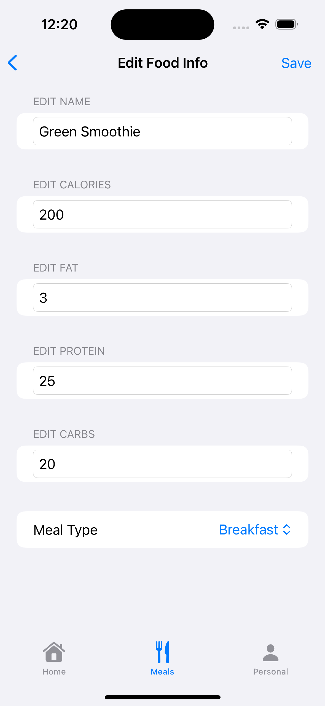

## calorieHub

**Daily nutrition tracking made easy** - Just what you need to get into shape and track your goals 

### On-boarding

  
  
  
  
  

### Main App

   
    
   
   

## Reliable and Easy to Use

Take ownership over your nutrition and fitness

- Track food while focusing on the big pictureo f what matters : calories and macro nutrients
- Set goals for daily calorie and steps goals while monitoring your progress each day
- App works with native iOS Health app to read your calories burned and steps completed each day to reach your fitness goals

### Technologies Used
- SwiftUI - I had broken the project up to numerous views to prevent views from being too large.
  1. Practiced a bit more bit more with Lists, Sheets, NavigationStack/NavigationDestination, Stacks, and styling Forms
  2. Learned to use @AppStorage for On-boarding
  3. Learned about ProgressViews (both SwiftUI ProgressView and building a custom Circular progress view)
  4. Learnd a bit more about scaling Images 
- HealthKit - Learned a lot about Apple's healthkit framework, healthstore, requesting permission to both read (HKQueries) and  write (HKQuantity,HKQuantityType, HKSample) data
- SwiftData - Learned more about using SwiftData, Querying, Saving Data, and building out my model containers with mock data for testing in #Preview (which took me forever to understand)

#### Comments
- I decided to build this app to learn SwiftData + HealthKit, and to build a simple nutrition tracker that easily tracked things I cared about in fitness : Total calories, macros, and steps burned
- App was completely designed and built entirely by myself. Some inspirations I took from were Noom (for onboarding views), LifeSum (for the dashboard), and MyFitnessPal
- Credit Pixabay and Flaticon for images + icons
